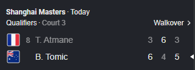
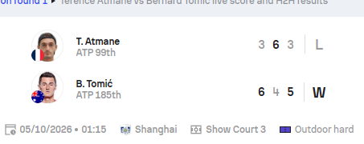
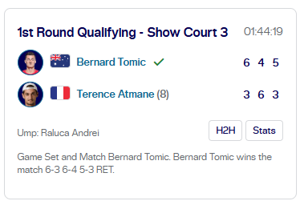
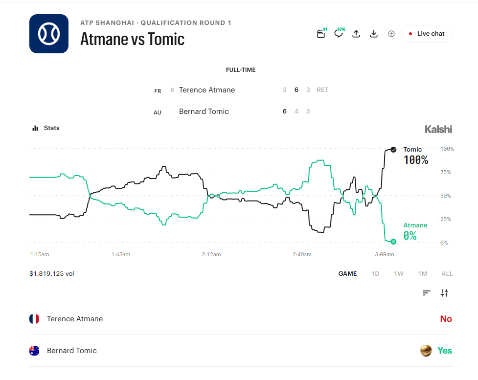

# Tennis: Retirement in the third set (Atmane vs. Tomic)

- **Type:** Retrospective
- **League:** ATP, Shanghai Masters qualifying, first round
- **Added:** 2026-10-05

## Scenario

On October 5, 2026, Terence Atmane (8th seed) and Bernard Tomic met in the first round of Shanghai Masters qualifying. Tomic won the first set 6-3, Atmane won the second 6-4, and Tomic led 5-3 in the third, serving for the match, when Atmane retired.

Sources disagreed on what kind of result this was. Google's score widget, above, labeled it a "Walkover," which is wrong under the ATP's own definitions: a walkover means the match never began (see League rules below). Kalshi's market page records it as a retirement (RET). A third results site showed only a plain W and L, with no retirement marker at all.

The ATP's official result records it as a retirement.[^atp-result]

Even the official result has an inconsistency. The line score shows Atmane winning the second set 6-4, but the summary text below it reads "6-3 6-4 5-3 RET," as if Tomic had won that set. The line score matches every other source, so it's the one to settle on. The lesson: check an official source against itself, not just against other sources.

As the rules below show, the type of result changes how markets settle.

## Markets affected

At the moment of retirement:

| Market | State at retirement |
|---|---|
| Match winner | Tomic advances. No natural finish. |
| First set winner | Completed: Tomic 6-3 |
| Second set winner | Completed: Atmane 6-4 |
| Third set winner | Incomplete: Tomic leads 5-3 |
| Total sets, over/under 2.5 | Two sets completed, third started but not finished |
| Total games | 27 completed games. No game was in progress at retirement. |
| Game spread, Tomic −3.5 | All games played: Tomic 15, Atmane 12 (+3). Completed sets only: Tomic 10, Atmane 9 (+1). Not covered either way. |

## What the rules say

### Kalshi

Kalshi's tennis game-margin contract (TENNISWINMARGIN, filed January 27, 2026) has a specific retirement rule. Contracts on completed scopes, like the first set, settle on the completed result. Contracts on incomplete scopes or the entire match resolve to the last fair price, set at the exchange's discretion.[^kalshi-margin]

Applied here, first- and second-set margin contracts settle normally. Full-match game margin contracts, including Tomic −3.5, go to last fair price.

The same contract also says that if a specified numbered set is not completed, the margin is deemed zero and the player is deemed not to have won that set.[^kalshi-margin] That reads as a "No" for a third-set contract, while the retirement rule reads as last fair price. See open questions below.

Kalshi's total-games contract family (KXATPTOTALGAMES) has its own retirement rule: markets that can be unconditionally settled based on play already completed resolve accordingly, and any that cannot resolve to fair market price at the exchange's discretion.[^kalshi-match]

The match winner is a separate contract, and it settled Yes for Tomic. If the same completed-play standard applied there, it would fit only if "who won" is read as the official result. Play completed so far didn't guarantee Tomic the win, since Atmane could have come back. But once Atmane retired, the official result named Tomic the winner, and that fact can't change. That reading is consistent with how the market settled. The clause sending markets on a retired player to last fair price belongs to the total-games family too, which is why it didn't apply to the match winner: Atmane settled No, not at a fair price. Kalshi's terms vary by contract family, so each market has to be read against its own terms.

Kalshi's total-games terms count completed games only. Unfinished games at the time of a retirement, default, or abandonment don't count toward the total.[^kalshi-match] Applied here, 27 games were completed. Any "over" line below 27 was already reached and settles Yes. Any line of 27.5 or higher couldn't be settled from completed play, so it goes to fair market price.

The total-games terms are about games, not sets, and nothing in them treats a partly played set as completed. Kalshi didn't list a total-sets market on this match, so the unfinished-set question never had to be answered live here. If one had been listed, it would most likely have counted two completed sets and sent over 2.5 to fair market price.

Kalshi did list an exact-score market (TENNISSETSCORE). Completed play already rules out half of it. With sets at 1-1, neither player can have won 2-0, so those outcomes are settled No by completed play alone. Only "Tomic 2-1" and "Atmane 2-1" were still open at retirement, and those can't be settled from completed play, so they go to last fair price. That isn't the pre-match price. It's the exchange's judgment of fair value at the moment play stopped.

### Sportsbooks

Both books put sport-specific rules ahead of their general rules. DraftKings ranks its Sport Rules above its general settlement rules,[^dk] and FanDuel's Missouri rules say the Specific Sports Rules prevail over the General Rules.[^fd-mo] So the tennis sections decide this case, not the general "interrupted event" language.

**DraftKings.** DraftKings' tennis rules start from a default: if a match starts but doesn't reach its natural end, including by retirement, bets are void unless settlement is already unconditionally determined, "unless otherwise stated in these Tennis Sport Rules."[^dk-assist] The moneyline is the stated exception: once the first set is completed, the moneyline has action, and the player who officially advances is the winner.[^dk-tennis] "Action" applies to the moneyline only; a retirement doesn't make every market on the match live.

An earlier version of DraftKings' tennis rules answered the total-sets question directly: if a match ends early, the set in progress counts, so a retirement in the third set means three sets were played.[^dk-2024] I couldn't find Missouri-specific wording, so it's unclear whether the current rules keep this.

Applied here: Tomic wins the moneyline and Atmane bets lose. First- and second-set markets stand. The game spread is void. Over 2.5 sets wins if the set in progress counts.

**FanDuel.** The Missouri rules confirm one sentence directly: after a retirement or disqualification at any point in the match, bets on completed service games and points stand.[^fd-mo] The rest of FanDuel's tennis approach comes from secondary and out-of-state sources. A published compilation of FanDuel's rules says bets on the player who advances win, bets on the retiring player are void rather than lost, and all other markets are void unless already "unequivocally determined."[^fd-compiled]

FanDuel's Ontario rules define "determined" for total games and game handicaps precisely: a bet counts as determined only if it would win no matter how the match finished, using the minimum number of games needed to complete it.[^fd-on] I couldn't confirm the same wording for Missouri.

Applied here: Tomic bets win, Atmane bets are refunded. Over 27.5 total games would win, since at least one more game was required to finish (27 played). Tomic −3.5 is void, because Atmane could still have come back to win the set, so no outcome was guaranteed. (This application relies on the out-of-state and compiled wording above.)

**Comparison.** All three pay the player who advances, but they treat the other side differently: DraftKings and Kalshi settle Atmane as a loss, while FanDuel refunds Atmane backers. All three refuse to settle the full-match game spread on the score at retirement, and none of them projects the most likely finish. FanDuel's minimum-games rule is the principled version of that idea: it only counts outcomes that hold under every possible finish, not the probable one.

The venues differ most on a line just above the games already played. Take over 27.5 total games with 27 completed:

| Venue | Standard | Over 27.5 |
|---|---|---|
| FanDuel (Ontario wording) | Guaranteed under the minimum possible finish | Wins, since finishing needed at least one more game |
| DraftKings | Already reached before the match ended | Void |
| Kalshi | Settled by completed play only | Fair market price |

Same match, same line, three different outcomes. That's the strongest argument in this entry for writing the "determined" standard into every contract explicitly.

### League

The 2026 ATP Official Rulebook sets the format: all singles matches are best of three tie-break sets.[^atp] So a third set is the deciding set, and "over 2.5 sets" means "the match went the distance."

The ATP's official definitions for recording results settle what kind of result this was:[^atp-k]

- **Retired:** the losing player retired because of illness or injury after the match had begun.
- **Walkover:** the match did not begin, because the losing player was ill, injured, or penalized before the first serve.
- **Abandoned, Incomplete, Weather:** the match began but was not completed for a reason *other than* default or retirement, and there is no winner or loser.

So this match is officially a retirement with a winner and a loser. It is not a walkover, and it is not an incomplete or abandoned match. That matters for settlement: the governing body treats a retirement as a finished result, while the sportsbooks accept that result for the moneyline but treat most other markets as if the match never reached its natural end.

The rulebook also shows how the ATP itself handles an unfinished match when it needs a count. In round-robin standings at the Nitto ATP Finals, a retirement counts as a straight-set win or loss, and games from matches involving the retiring player are left out of the games-won percentage entirely.[^atp-finals] The stated reason is to stop a player who only needs one set from winning it and then retiring.

That rule is scoped to round-robin tie-breaks, so it doesn't decide anything here. But it's a useful contrast. For counting sets, the ATP's own convention in that context would score this match as a straight-set win (two sets), while DraftKings' earlier rule counted three. And for games, the ATP chose to exclude the unfinished match rather than project its finish.

The league rules decide what officially happened. They don't decide how a market settles. Whether an unfinished set "counts" is a question each contract has to answer for itself.

## What happened

Kalshi's match winner market settled Yes for Tomic and No for Atmane, with the result shown as a retirement. The market traded about $1.8 million.

Markets Kalshi listed on this match: match winner, set 1 winner, set 2 winner, total games, game spread, and exact score. There was no total-sets market.

| Market | Settlement |
|---|---|
| Match winner | Yes for Tomic, No for Atmane |
| Set 1 and set 2 winner | Resolved on the completed sets |
| Total games | Resolved [TODO: record which lines settled Yes and which went to fair market price, with the prices] |
| Exact score | Pending as of writing [TODO: record the 2-0 lines and the fair price for the 2-1 lines] |
| Game spread | Pending as of writing [TODO: record the settlement and price] |

The two pending markets are the two whose outcome completed play couldn't decide, which is what the rules predict.

## Open questions

**Does an unfinished set count as a set played?** For a total-sets market, the answer decides the result. If only completed sets count, the total is 2 and the under wins. If a started set counts, it's 3 and the over wins. Even the rule-makers split: DraftKings' earlier rule counted three, while the ATP's round-robin convention scores a retirement as a straight-set result. Kalshi's margin contract counts only completed sets for set margins, which suggests one answer, but a total-sets contract needs to say it explicitly.

**Which rule governs an incomplete numbered set after a retirement?** The margin contract says both "incomplete set means the player did not win it" and "incomplete scopes go to last fair price." The retirement rule is more specific and probably controls, but the contract shouldn't leave that to interpretation.

**What counts toward a full-match game margin?** Kalshi's margin contract calculates entire-match margins across completed sets only.[^kalshi-margin] That gives Tomic +1, not the +3 you get from every game played. The retirement rule sends this market to last fair price anyway, but the two definitions would give different answers in any case where a set is unfinished.

**Should the full-match game spread use a projected finish?** No. Projecting Tomic closing out the set at 6-3 gives a +4 margin, which would flip Tomic −3.5 from not covered to covered. Settling on a game that was never played pays one side for a result that didn't happen. Last fair price captures Tomic's strong position at the time of retirement without inventing a score. FanDuel's minimum-games test shows the same principle from the sportsbook side: settle only what was guaranteed, not what was likely.

## My recommendation

!!! ruling "Clarification I would publish"
    Atmane vs. Tomic ended when Atmane retired during the third set. This was a retirement, not a walkover. Markets settle as follows. First set and second set markets settle on their completed results. Markets on the third set and on the full-match game margin resolve to the last fair price. The match winner market settles Yes for Tomic, who advances. For total-sets markets, a set counts as played once its first point is played, so this match counts as three sets.

## Reasoning

The completed sets are facts, so settling them is straightforward and matches both Kalshi and DraftKings.

For the match winner, I agree with how Kalshi settled it. Once play starts, the player who advances is a clean, official outcome that needs no judgment call. FanDuel's choice to refund the retiring player's backers is a sportsbook option an exchange doesn't have, since every Yes contract has a No on the other side.

For the game spread, last fair price is the right tool on an exchange. A sportsbook can void and refund, but an exchange can't, because traders entered at many different prices. Last fair price reflects the state of the match at retirement, with Tomic serving for the match, without paying out on games that were never played. I'd never project the unplayed games, and this match shows why: the projection flips the result.

For total sets, I'd count a set once it starts. The market asks how long the match went, and once the third set began, "fewer than three sets" was impossible. An earlier version of DraftKings' rules made exactly this call. Counting only completed sets would pay the under on a match that clearly went to a third set, which no trader would expect. Whichever way Kalshi goes, the rule should be written into the contract before the next retirement, since tennis retirements are common.

The data issue matters too. Three sources showed three different things: a walkover, a retirement, and a plain win. Under Kalshi's rules a walkover sends every market to last fair price, so settling from the wrong label would have been wrong across the board, on a market with $1.8 million in volume. When sources disagree, settlement comes from the official source.

[^kalshi-margin]: [KalshiEX LLC, TENNISWINMARGIN contract terms, CFTC filing](https://www.cftc.gov/sites/default/files/filings/ptc/26/01/ptc01272637960.pdf), January 27, 2026, accessed 2026-10-05.
[^dk]: [DraftKings Massachusetts Sportsbook House Rules](https://massgaming.com/wp-content/uploads/DraftKings-House-Rules-8.18.25.pdf), Section II(C)(x)(2) and definitions, implemented August 26, 2025, accessed 2026-10-05.
[^dk-tennis]: [DraftKings Tennis Sport Rules](https://sportsbook.draftkings.com/help/sport-rules/tennis), accessed 2026-10-05. Missouri-specific wording was not available.
[^dk-assist]: [DraftKings Support (@DK_Assist), quoting the Tennis Sport Rules](https://x.com/DK_Assist/status/2015939993437434230), January 27, 2026.
[^dk-2024]: [DraftKings Massachusetts Sportsbook House Rules, May 2024 version](https://massgaming.com/wp-content/uploads/DraftKings-House-Rules-5.14.24.pdf), Tennis, Total Sets, accessed 2026-10-05.
[^fd-mo]: [FanDuel Sportsbook House Rules, Missouri](https://www.fanduel.com/fanduel-sportsbook-house-rules-MO), effective July 30, 2026, Part A(1) and Part C (Tennis), accessed 2026-10-05.
[^fd-compiled]: FanDuel tennis house rules, as compiled by [Tennisform](https://www.tennisform.com/default.asp?action=houserules), accessed 2026-10-05.
[^fd-on]: [FanDuel Sportsbook House Rules, Ontario](https://www.fanduel.com/fanduel-sportsbook-house-rules-on), Tennis, accessed 2026-10-05.
[^atp]: [2026 ATP Official Rulebook](https://www.itftennis.com/media/15604/atp-2026-rulebook.pdf), Section 1.02(B), accessed 2026-10-05. Section 1.06 states the online ATP version is the official one.
[^atp-k]: 2026 ATP Official Rulebook, Exhibit K (Glossary), "Draw Results," p. 348.
[^atp-finals]: 2026 ATP Official Rulebook, Section 4.01 (Nitto ATP Finals, Singles), round-robin tie-breaking procedures. Section 4.04 (Next Gen ATP Finals) has the same rule.
[^atp-result]: [ATP Tour, Shanghai 2026 results](https://www.atptour.com/en/scores/archive/shanghai/5014/2026/results), 1st Round Qualifying, accessed 2026-10-05.
[^kalshi-match]: [Kalshi, Atmane vs Tomic market rules](https://kalshi.com/markets/kxatpmatch/atp-tennis-match/kxatpmatch-26oct05atmtom), accessed 2026-10-05.
